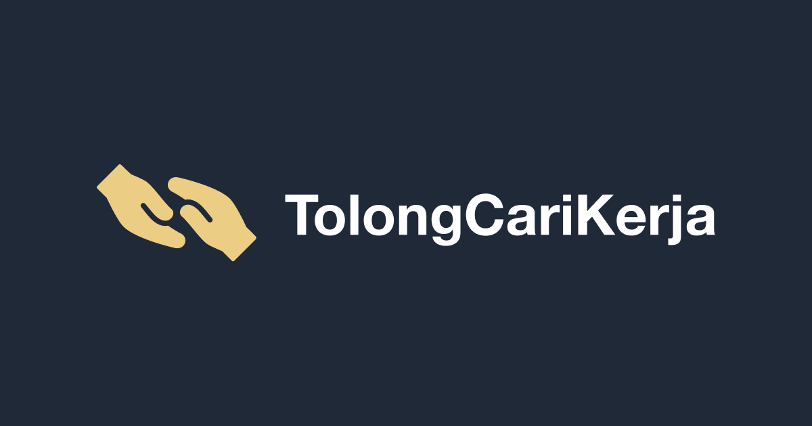
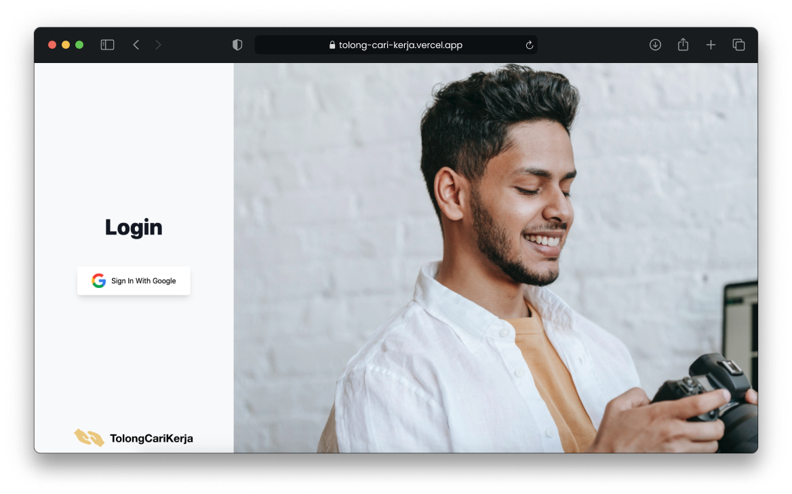
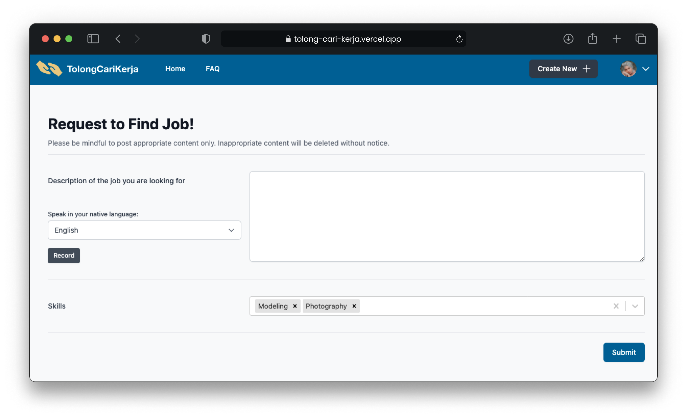

# TolongCariKerja

## Introduction

TolongCariKerja is an initiative to help Malaysians find jobs easily while supporting the #KitaJagaKita movement in Malaysia through A.I. speech services. TolongCariKerja means “Help Find Work” as a direct translation from Malay to English.

Information Slides by Author: [Click here to access Google Slides](https://docs.google.com/presentation/d/17gFhUN_8uc5AK8H5eonSIXUt3LgwkhDMaluGy3tlbSc/edit?usp=sharing)

Website Link: [TolongCariKerja](https://tolong-cari-kerja.vercel.app)

Project Duration: Jul 31 2021 - Aug 06 2021 (7 days)

## Problem

“99,969 Malaysians lost their jobs as of Nov 27 2020”, by Malaysia’s Human Resources Ministry (Dec 9, 2020)

“A million people may lose jobs under another strict MCO”, by Tengku Zafrul, Malaysia’s Finance Minister (May 24, 2021)

Since the months-long lockdown and 20,000+ cases as of Aug 2021, many Malaysians are facing financial difficulties. With the #KitaJagaKita movement.

#Kitajagakita is a "one-stop shop" for Malaysian civil society COVID19 efforts, by KitaJagaKita.com

## Unique Features

1. Record yourself speaking in other common languages found in Malaysia.

2. Watch as it auto-translates and auto-transcribe it!

Languages support: Malay, Chinese, Cantonese and English

## Motivation of adding A.I.: 

1. Azure has built-in Speech-To-Text and Translator API for developers to use.

2. This A.I. integration can help reduce the language barrier and assist people who are illiterate in Malaysia.

3. Additional customizations can be done to localize the app for Malaysia’s unique language jargons.


## Tech Stack

| Area              | Technology Used                           |
|-------------------|-------------------------------------------|
| Frontend          | React.js                                  |
| Backend           | Next.js                                   |
| Cloud Provider    | Azure                                     |
| Database          | Azure CosmosDB                            |
| Server Deployment | Next.js                                   |
| Authentication    | NextAuth.js                               |
| Third Party APIs  | Cloudinary                                |
| Cloud APIs        | Azure Translator and Azure Speech-To-Text |

## Running TolongCariKerja in your local machine

1. Install node_modules
```bash
yarn
```

2. Configuring env variables
Unfortunately, I won't be providing the secret env variables that I use, but these are the variables:

| Environment Variables    |
|--------------------------|
| GOOGLE_CLIENT_ID         |
| GOOGLE_CLIENT_SECRET     |
| NEXTAUTH_URL             |
| MONGODB_URI              |
| CLOUDINARY_UPLOAD_PRESET |
| CLOUDINARY_CLOUD_NAME    |
| CLOUDINARY_API_KEY       |
| CLOUDINARY_API_SECRET    |
| AZURE_STT_KEY            |
| AZURE_STT_REGION         |
| AZURE_TRANSLATE_KEY      |
| AZURE_TRANSLATE_REGION   |

3. Run the app!
```bash
yarn dev
```

## Screenshots of TolongCariKerja





## Contributors

- [Jason Beh](https://github.com/behjieshen)